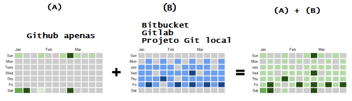

# my-git-usage-evidences

O [Calendário de contribuições do Github](https://help.github.com/pt/github/setting-up-and-managing-your-github-profile/viewing-contributions-on-your-profile#contributions-calendar) 
reflete suas várias atividades de contribuição no Github, mas só as do Github,
quem vê-lo talvez conclua que você não anda codando muito, e isso pode ser um problema!

Muitas vezes nossos projetos estão no Bitbucket, no Gitlab ou mesmo são projetos 
Git versionados localmente apenas, e nada das atividades que você realiza nesses projetos é 
refletido no Github.

Esse programa aqui resolve esse problema refletindo no Calendário de contribuições do Github 
todo commit que você executa nos seus projetos Git configurados por ele.

Veja na imagem abaixo um exemplo. Em (A) você tem o que o Github refletiu de uso por você em um 
determinado mês. Em (B) existe a realidade que o Github não reflete, que é o fato de que
você também realiza diversas atividades diariamente só que em um outro repositório central, por exemplo,
no Bitbucket ou Gitlab ou mesmo em um projeto Git local apenas. (A) + (B) é o resultado desse programa
aqui, ele reflete no Calendário de contribuições do Github o que você fez nos seus outros repositórios 
centrais também.   

## Como usar esse programa

1. Instale o programa. Para isso use o instalador: [my-git-usage-evidences-inst-win64.exe](https://github.com/flauberjp/my-git-usage-evidences/releases/download/1.4-SNAPSHOT-alpha.1/my-git-usage-evidences-inst-win64.exe).

2. Inicie o programa.

3. Configure o programa. 
    * No programa, digite suas credenciais do Github 
    (username e password).
    * Selecione seus projetos Git que deseja monitorar o uso do git neles.
      * Para isso, selecione uma pasta que contém a maioria dos seus
      projetos git, clicando no botão "_Selecionar_" e escolhendo a pasta.
      Essa pasta será analisada, e apenas projetos git que não são projetos
      Github serão listados. 
        * Os projetos Github não são listados pois o uso do Git neles já é realizado automaticamente pelo próprio Github;
      * Marque os projetos que você quer monitorar.

4. Aplique a configuração.
    * Clique no botão "_Aplicar configurações_", e aguarde a mensagem
    de confirmação de que tudo foi configurado corretamente. 

## Testando o programa

1. Abra um dos seus projetos git que você acabou de configurar com esta solução.
2. Faça uma alteração em qualquer arquivo, então realize um commit, que disparará nossa solução.
3. Verifique no seu github que o repo _my-git-usage-evidences-repo_ teve o número de commits incrementado.
4. Repita os passos anteriores para vê-lo aumentar mais uma vez se preciso, o que é uma 
evidência de que você acabou de usar o git localmente refletida no Github.

## Ajuda Voluntária
Amamos voluntários! Venha tornar esse programa ainda mais incrível! 

Por favor leia as instruções em [Seja Voluntário](CONTRIBUTING.md) para verificar como você pode começar a ajudar.

## License
[MIT](https://pt.wikipedia.org/wiki/Licen%C3%A7a_MIT)

